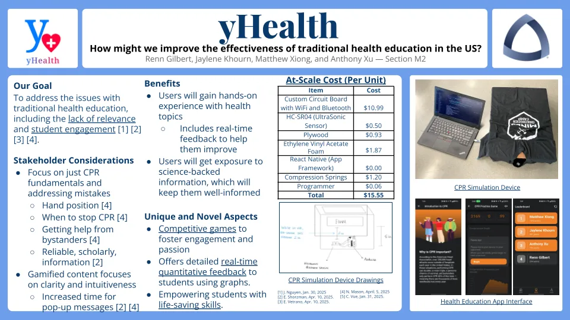
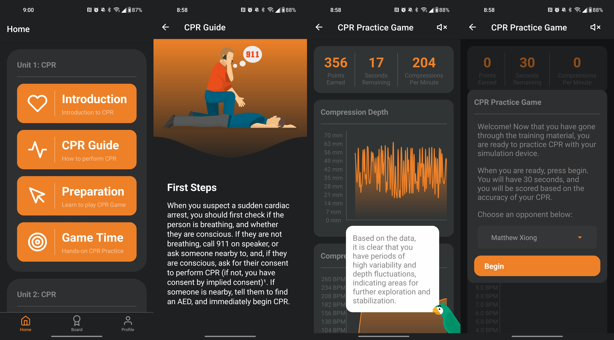

# yHealth

## Renn Gilbert, Jaylene Khourn, Matthew Xiong, and Anthony Xu

[Video Demo](https://renntg.com/videos/yhealth/demo.mp4)

Prototype for an interactive health education app — offers competitive CPR game integrated with a physical CPR simulation device. First place winner in the Spring 2025 Cornerstone Design competition at the Colorado School of Mines.

<video controls src="https://renntg.com/videos/yhealth/demo.mp4" title="Demo"></video>

## Design

The app was built with Expo and React Native, and we opted to use React Native Async Storage for storing user and leaderboard data, rather than a separate backend, for our prototype.

To communicate with the Arduino and its sensors, the Arduino outputs the depth of compression data, collected by the ultrasonic sensor, to serial output. Then, a WebSocket server, created with the Python WebSockets Library, mirrors that output to all clients. For a full-scale design, bluetooth would be a better solution, as it would likely be more convenient for users.

The largest challenge was sending real-time data from the Arduino to the mobile app fast enough to be able to calculate accurate depth and frequency data from it. Initially, data was sent 5 times per second, which frequently caused the app to crash. By grouping data points in sets of 10, we were able to increase the number of data points to 20 per second, which significantly increased the accuracy of the depth and frequency data for each compression.
